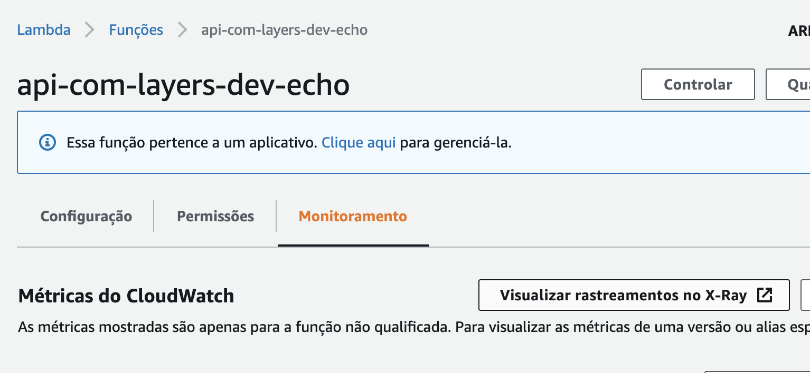
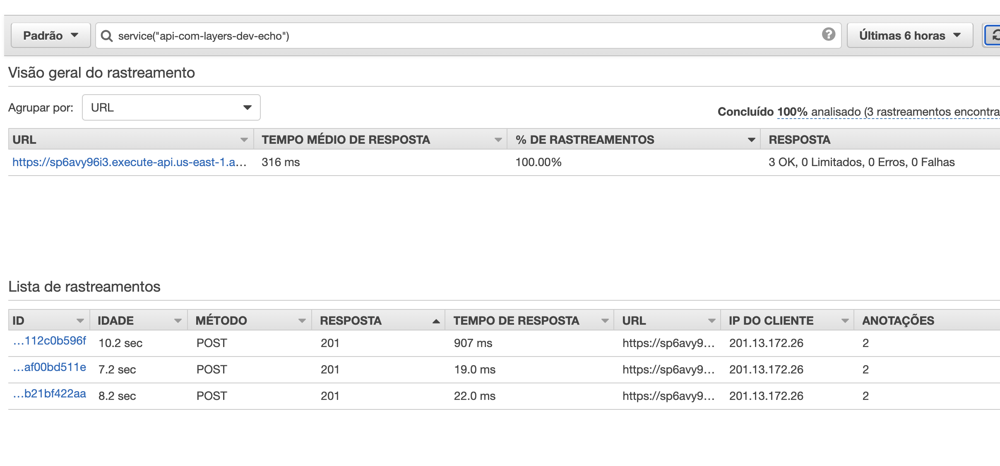

1. Execute o comando `cd ~/environment/senai-serverless/exercicios/ApiGateway/` para entrar na pasta do exercício.
2. Construa um requirements.txt com o conteudo:
    1. aws-xray-sdk
    2. boto3
3. Instale/Baixe o requisitos do requirements.txt dentro de uma pasta chamada layers
4. Crie um handler.py e configure ele para ser uma lambda que utilizará layers e pegar as dependencias do "/opt"
5. Configure o handler.py para utilizar X-Ray afim de gerar métricas sobre as chamadas. Utilize o o código de 7 linhas que esta na documentação de implementação python de x-ray na seção [service plugin](https://docs.aws.amazon.com/xray/latest/devguide/xray-sdk-python-configuration.html#xray-sdk-python-configuration-plugins)
6. Importe o pacote json para lidar com os payloads do evento
7. Crie um método handler que recebera o evento e contexto das chamadas da api. Esse método deve:
   1. Identificar o campo "Message" que virá no event payload das chamadas da api feitas pelo usuario e atribuir a uma variavel.
   2. Montar a respota da api retornando apenas o campo "Message" do payload recebido e status 201.

8. Crie um arquivo serverless.yml com:
   1. Serviço: api-com-layers
   2. Runtime: python3.8
   3. Tracing do X-Ray para api gateway e lambda confirme a documentação do [serverless framework](https://www.serverless.com/blog/framework-release-v141)
   4. IAM Role que inclua permissão de x-ray ao lambda:
   ``` yaml
   iamRoleStatements:
    - Effect: "Allow" # xray permissions (required)
      Action:
        - "xray:PutTraceSegments"
        - "xray:PutTelemetryRecords"
      Resource:
        - "*"
   ```
   1. Criar uma layer que aponte para a pasta layers criada no passo 3
   2. O pacote do lambda deve excluir a pasta layers
   3. Criar um lambda com:
      1. Evento HTTP
      2. Caminho POST que responda no "/echo"
      3. Utilize a layer criada

9. Faça o deploy com `sls deploy`
10. Faça chamadas posts para o endpoint que o serverless framework criou com o payload:
    ``` json
    {
        "usuario":"senai",
        "ID": 3030,
        "Message": "api echo test"
    }
    ```
11. A resposta deverá ser:
    ``` json
    {
        "Message":"api echo test"
    }
    ```
12. Para ver os dados que foram enviados ao X-Ray vá na função lambda criada pelo painel e clique em `Visualizar rastreamentos no X-Ray`.
    
    

    
    
